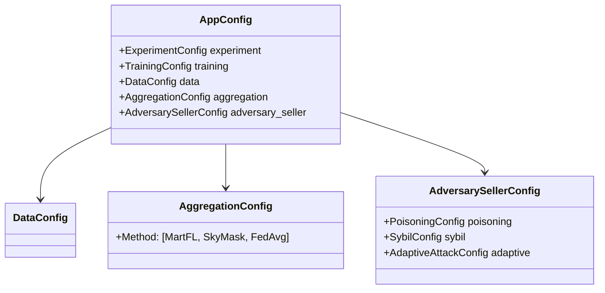

# Benchmarking Robust Aggregation in Decentralized Gradient Marketplaces

## 📖 Overview

This repository contains the official implementation of the benchmark framework presented in **"[Insert Paper Title]"**.
It provides a modular, reproducible environment to evaluate the robustness of decentralized learning aggregators against
various adversary models (Sybil, Poisoning, Adaptive) across Image, Text, and Tabular modalities.

## 🏗️ Environment Setup

To ensure reproducibility, we recommend running this framework in a dedicated Conda environment.

### 1\. Prerequisites

* **OS:** Ubuntu 20.04 / 22.04 LTS
* **Package Manager:** [Anaconda](https://www.anaconda.com/)
  or [Miniconda](https://docs.conda.io/en/latest/miniconda.html)

### 2\. Installation Steps

Run the following commands in your terminal to set up the environment:

```bash
# 1. Create a clean Conda environment (using Python 3.10)
conda create -n dgm python=3.10 -y

# 2. Activate the environment
conda activate dgm

# 3. Upgrade pip to avoid dependency resolution errors
pip install --upgrade pip

# 4. Install Python dependencies
pip install -r requirements.txt
```

-----

# 🛠️ Scripts & Configurations

### Experiment Orchestrator

The entire benchmark is driven by a custom orchestration script (`entry/run_parallel_experiment.py`) designed for
reliability and high-throughput parallel execution.

**Key Features:**

* **Parallel Execution:** Automatically distributes experiments across available CPU cores or GPU devices.
* **State Management:** Uses file-based locking (`.lock`) and success markers (`.success`) to skip completed runs. You
  can safely interrupt and resume the script.
* **Automated Recovery:** Detects `NaN`/`Inf` divergences and retries up to 3 times.

### 🔧 CLI Arguments

| Argument          | Default             | Description                                                                       |
|:------------------|:--------------------|:----------------------------------------------------------------------------------|
| `--configs_dir`   | `configs_generated` | Path to the directory containing generated YAML configs.                          |
| `--gpu_ids`       | `None`              | Comma-separated list of CUDA device IDs (e.g., `0,1,2`). If omitted, runs on CPU. |
| `--num_processes` | `os.cpu_count()`    | Total number of parallel workers.                                                 |
| `--force_rerun`   | `False`             | Ignores existing success markers and forces re-execution.                         |

**Example Usage:**

```bash
# Run experiments on GPUs 0 and 1 with 4 parallel workers
python entry/run_parallel_experiment.py --gpu_ids 0,1 --num_processes 4 --configs_dir 'configs_generated/step10_main_summary'
```

-----

# 🎛️ Unified Configuration System

Our framework adopts a **Single-Entry, Data-Driven** architecture. The entire experimental logic is controlled by a
strictly typed hierarchy of configuration objects (`dataclasses`). `main.py` remains static, while the YAML
configuration dictates the experiment logic.

## Configuration Hierarchy

The root configuration object is `AppConfig`, which orchestrates the following modular subsystems:



## Component Overview

| Config Module               | Responsibility                                                                           |
|:----------------------------|:-----------------------------------------------------------------------------------------|
| **`DataConfig`**            | Switches context between **Image** (CIFAR), **Text** (TREC), and **Tabular** (Texas100). |
| **`AggregationConfig`**     | Defines the server's defense (e.g., swapping `fedavg` to `skymask`).                     |
| **`AdversarySellerConfig`** | A unified profile for malicious sellers (Backdoor, Sybil, Drowning).                     |

-----

# ⚙️ Automated Configuration Pipeline

To ensure fair comparison, we use Python scripts to programmatically generate the experiment suites.

**Workflow:**

1. **Generate:** Run a step script (below) to create YAML files in `configs_generated/`.
2. **Execute:** Run `entry/run_parallel_experiment.py` pointing to that folder.

## Generation Script Roadmap

To reproduce specific parts of the paper, use the corresponding generation script to create the configuration files,
then run them using the orchestrator.

| Step   | Script Path                                                  | Purpose                                                                                                                                         | Corresponds To                          |
|:-------|:-------------------------------------------------------------|:------------------------------------------------------------------------------------------------------------------------------------------------|:----------------------------------------|
| **1**  | `entry/gradient_market/generate_step1_iid_tuning.py`         | **Benign Baselines:** Establishes the ideal optimizer and learning rate for standard `FedAvg` (Benign) across all datasets.                     | **Table 1** (Baseline Performance)      |
| **2**  | `entry/gradient_market/generate_step2_find_usable_hps.py`    | **Fairness Calibration:** Runs a sweep to find "usable" training HPs (LR, Optimizer) specifically for *each defense* to ensure fair comparison. | **Fairness Methodology**                |
| **3**  | `entry/gradient_market/generate_step3_defense_tuning.py`     | **Defense Hyperparameter Search:** Uses optimal LRs from Step 2 to tune internal defense parameters (e.g., `clip_norm`, `max_k`).               | **Figures 3 & 4** (Defense Sensitivity) |
| **4**  | `entry/gradient_market/generate_step4_attack_sensitivity.py` | **Attack Sensitivity:** Evaluates defense performance under varying attack strengths (Poison Rates).                                            | **Attack Analysis**                     |
| **5**  | `entry/gradient_market/generate_step5_advanced_sybil.py`     | **Sybil Attacks:** Configures coordinated Sybil attacks (Mimicry, Pivot, Knock-out) against the marketplace.                                    | **Sybil Robustness Section**            |
| **6**  | `entry/gradient_market/generate_step6_adaptive_attack.py`    | **Adaptive Attacks:** Configures sophisticated individual attacks (Stealthy Drowning, Gradient Manipulation).                                   | **Adaptive Defense Section**            |
| **7**  | `entry/gradient_market/generate_step7_buyer_attacks.py`      | **Buyer Attacks:** Simulates malicious buyers attempting DoS, Starvation, or Class Exclusion attacks.                                           | **Buyer Threat Analysis**               |
| **8**  | `entry/gradient_market/generate_step8_scalability.py`        | **Scalability Tests:** Measures system throughput and accuracy as the number of sellers increases (10 to 100+).                                 | **Scalability Figures**                 |
| **9**  | `entry/gradient_market/generate_step9_heterogeneity.py`      | **Heterogeneity Impact:** Tests robustness under varying degrees of Non-IID data distributions (Dirichlet alpha).                               | **Ablation Studies**                    |
| **10** | `entry/gradient_market/generate_step10_main_summary.py`      | **Main Benchmark:** The comprehensive suite combining the best parameters for the final comparison.                                             | **Figure 5** (Main Results)             |

-----

## 📊 Reproducing Results

After running the experiments, use the analysis scripts to generate the paper figures.

| Paper Content | Script Path                                                                                                                         |
|:-------------|:------------------------------------------------------------------------------------------------------------------------------------|
| **Table 1**  | `entry/gradient_market/visualization/step3_visual.py`                                                                               |
| **Figure 2** | `entry/gradient_market/visualization/step10_summary.py`                                                                             |
| **Figure 3** | `entry/gradient_market/visualization/step3_visual.py`                                                                               |
| **Figure 4** | `entry/gradient_market/visualization/step4_visual.py`                                                                               |
| **Figure 5** | `entry/gradient_market/visualization/step8_scalability_visual.py`                                                                   |
| **Figure 6** | `entry/gradient_market/visualization/step5_visual_sybil.py` & `entry/gradient_market/visualization/step6_visual_adaptive_attack.py` |
| **Figure 7** | `entry/gradient_market/visualization/step7_fltrust_martfl.py`                                                                       |
| **Figure 8** | `entry/gradient_market/visualization/step7_fltrust_martfl.py`                                                                       |
| **Figure 9** | `entry/gradient_market/visualization/step9_heterogeneity_visual.py`                                                                 |
| **Figure 10** | `entry/gradient_market/visualization/step10_valuation.py`                                                                           |

-----

## License

This project is licensed under the [MIT License](https://www.google.com/search?q=./LICENSE).

